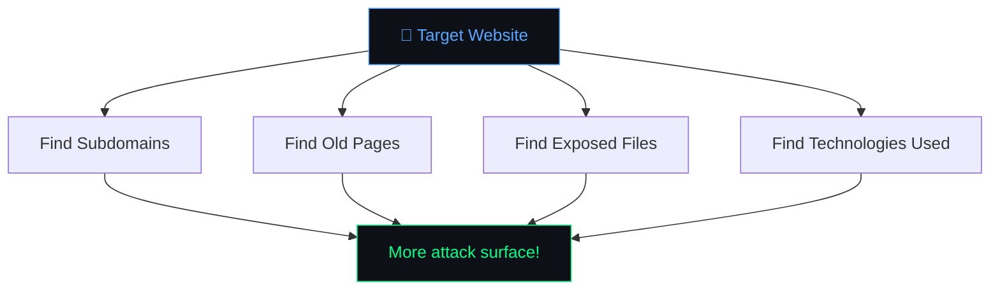
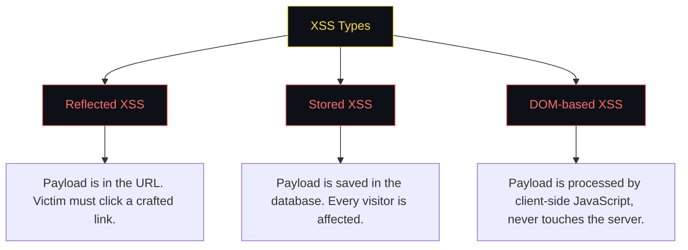

# 🟢 Day 1 — The Hacker Mindset

> **Topics:** Reconnaissance → SQL Injection → Cross-Site Scripting (XSS)

[← Back to Home](./README.md) · [Day 2 →](./Day-2.md)

---

## 🗺️ Today's Roadmap


---

## 🌐 What is Bug Bounty Hunting?

Companies invite hackers to **find and report security vulnerabilities** in their applications — and **pay real money** for valid findings.

```
┌──────────────────────────────────────────────────────────────────┐
│                    HOW BUG BOUNTY WORKS                          │
│                                                                  │
│   You (Hacker)          Company              Reward              │
│   ┌─────────┐          ┌─────────┐          ┌─────────┐        │
│   │ Find a  │  report  │ Verify  │  valid   │  💰 Get │        │
│   │  Bug    │ ───────► │ the Bug │ ───────► │  Paid!  │        │
│   └─────────┘          └─────────┘          └─────────┘        │
│                                                                  │
│   Real Payouts:                                                  │
│   • Low severity:     $50 – $500                                │
│   • Medium severity:  $500 – $2,000                             │
│   • High severity:    $2,000 – $10,000                          │
│   • Critical:         $10,000 – $100,000+                       │
└──────────────────────────────────────────────────────────────────┘
```

### The OWASP Top 10

The **OWASP Top 10** is a list of the most critical web application security risks. Think of it as the "greatest hits" of web vulnerabilities:

| # | Vulnerability | What It Means |
|---|-------------|--------------|
| 1 | Broken Access Control | Accessing things you shouldn't |
| 2 | Cryptographic Failures | Weak or missing encryption |
| 3 | Injection | SQLi, XSS, Command Injection |
| 4 | Insecure Design | Flawed application logic |
| 5 | Security Misconfiguration | Default passwords, exposed files |
| 6 | Vulnerable Components | Using outdated libraries |
| 7 | Authentication Failures | Broken login/session systems |
| 8 | Data Integrity Failures | Insecure deserialization |
| 9 | Logging Failures | Not detecting attacks |
| 10 | SSRF | Server-Side Request Forgery |

> 📖 Full list: [owasp.org/www-project-top-ten](https://owasp.org/www-project-top-ten/)

---

---

<!-- ⏱️ INSTRUCTOR: ~40 min (15 min demo + 25 min hands-on) -->
## 🔍 Topic 1: Reconnaissance (Recon) 🟢 Easy

### What is Recon?

Reconnaissance is the **information gathering phase** — before you hack anything, you need to know what exists. It's like a burglar checking which doors and windows a house has before trying to break in.

> **"Give me six hours to chop down a tree and I will spend the first four sharpening the axe."** — Abraham Lincoln



### Key Recon Techniques

#### 1. Subdomain Enumeration
Find hidden subdomains like `admin.example.com`, `staging.example.com`, `api.example.com`.

**Tool: crt.sh** — [https://crt.sh](https://crt.sh)

Try it now:
- Go to [crt.sh](https://crt.sh)
- Search for `%.tesla.com`
- See all the subdomains Tesla has!

#### 2. Google Dorking
Use advanced Google searches to find exposed information.

| Google Dork | What It Finds |
|------------|--------------|
| `site:example.com` | All indexed pages of a site |
| `site:example.com filetype:pdf` | All PDF files on the site |
| `site:example.com inurl:admin` | Admin pages |
| `site:example.com intitle:"index of"` | Directory listings (exposed files!) |
| `site:example.com ext:log \| ext:txt \| ext:conf` | Exposed config/log files |

#### 3. Wayback Machine
See **old versions** of a website — sometimes old pages have vulnerabilities that still exist.

**Tool:** [https://web.archive.org](https://web.archive.org)

#### 4. Shodan — The Hacker's Search Engine
Searches for **internet-connected devices** — servers, webcams, databases, IoT devices. You can find exposed services that shouldn't be public.

**Tool:** [https://shodan.io](https://shodan.io) (free account for basic searches)

Try searching: `apache city:"New York"` or `port:3306 country:US` (exposed MySQL databases!)

#### 5. SecurityTrails
Get detailed **DNS records, historical data, and associated domains** for any target.

**Tool:** [https://securitytrails.com](https://securitytrails.com) (free account available)

#### 6. Technology Detection
Know what a website is built with (WordPress? React? PHP?) to find known vulnerabilities.

**Tool: Wappalyzer** — Free browser extension ([Chrome](https://chrome.google.com/webstore/detail/wappalyzer/gppongmhjkpfnbhagpmjfkannfbllamg) / [Firefox](https://addons.mozilla.org/en-US/firefox/addon/wappalyzer/))

### 🧪 Hands-On: Try It Yourself!

> 1. Go to [crt.sh](https://crt.sh) and search `%.example.com` (replace with any company)
> 2. Open Google and try: `site:github.com "password" filetype:env`
> 3. Check any website on [web.archive.org](https://web.archive.org)
> 4. Browse [shodan.io](https://shodan.io) and search for something interesting

---

---

<!-- ⏱️ INSTRUCTOR: ~90 min (30 min theory + 60 min labs) -->
## 💉 Topic 2: SQL Injection (SQLi) 🟡 Medium

### What is SQL Injection?

SQL (Structured Query Language) is the language used to talk to databases. When a website **takes your input and puts it directly into a database query**, you can manipulate that query.

### How It Works

Imagine a login form. Behind the scenes, the website runs:

```sql
SELECT * FROM users WHERE username = 'INPUT' AND password = 'INPUT'
```

If you type `admin' --` as the username:

```sql
SELECT * FROM users WHERE username = 'admin' --' AND password = 'anything'
```

The `--` is a SQL comment — it **ignores everything after it**, including the password check! 🎉

```
┌──────────────────────────────────────────────────────────────────┐
│                    SQL INJECTION — VISUALIZED                    │
│                                                                  │
│   Normal Login:                                                  │
│   ┌──────────────┐     ┌──────────────┐     ┌──────────────┐   │
│   │  Username:   │     │   SELECT *   │     │   ❌ Login   │   │
│   │  john        │ ──► │   WHERE      │ ──► │   Failed     │   │
│   │  Password:   │     │   user='john'│     │   (wrong pw) │   │
│   │  wrong123    │     │   AND pw=    │     │              │   │
│   └──────────────┘     │   'wrong123' │     └──────────────┘   │
│                        └──────────────┘                         │
│                                                                  │
│   Injected Login:                                                │
│   ┌──────────────┐     ┌──────────────┐     ┌──────────────┐   │
│   │  Username:   │     │   SELECT *   │     │   ✅ Login   │   │
│   │  admin' --   │ ──► │   WHERE      │ ──► │   Success!   │   │
│   │  Password:   │     │   user=      │     │   (password  │   │
│   │  anything    │     │   'admin'    │     │    skipped!) │   │
│   └──────────────┘     └──────────────┘     └──────────────┘   │
└──────────────────────────────────────────────────────────────────┘
```

### Common SQL Injection Payloads

| Payload | What It Does |
|---------|-------------|
| `' OR 1=1 --` | Always true → bypasses login |
| `' UNION SELECT null,null --` | Extracts data from other tables |
| `' OR '1'='1` | Another always-true condition |
| `admin' --` | Logs in as admin, skips password |

### 🧪 Hands-On Labs

> **Do these labs in order. We'll walk through the first one together!**

#### Part A — PortSwigger Labs

| # | Lab | What You'll Learn | Link |
|---|-----|------------------|------|
| 1 | **SQL injection — retrieving hidden data** | Use `' OR 1=1 --` to see hidden products | [🔗 Start Lab](https://portswigger.net/web-security/sql-injection/lab-retrieve-hidden-data) |
| 2 | **SQL injection — login bypass** | Log in as administrator without a password | [🔗 Start Lab](https://portswigger.net/web-security/sql-injection/lab-login-bypass) |
| 3 | **SQL injection UNION attack — finding columns** | Use UNION to extract data from other tables | [🔗 Start Lab](https://portswigger.net/web-security/sql-injection/union-attacks/lab-determine-number-of-columns) |

<details>
<summary>💡 Hint for Lab 1</summary>

The product category filter is vulnerable. Try modifying the URL or the category parameter:
```
' OR 1=1 --
```
This makes the WHERE clause always true, showing ALL products including hidden ones.
</details>

<details>
<summary>💡 Hint for Lab 2</summary>

In the login page, try this as the username:
```
administrator'--
```
This closes the username string and comments out the password check.
</details>

<details>
<summary>💡 Hint for Lab 3 (UNION)</summary>

Use `ORDER BY` to find the number of columns:
```
' ORDER BY 1--
' ORDER BY 2--
' ORDER BY 3--
```
Keep increasing until you get an error — that tells you the column count. Then use:
```
' UNION SELECT NULL,NULL,NULL--
```
(Match the number of NULLs to the column count)
</details>

#### Part B — OWASP Juice Shop (Bonus)

Open [OWASP Juice Shop](https://juice-shop.herokuapp.com) and try these:
1. Go to the **login page** → type `' OR 1=1 --` as the email and anything as password
2. You should log in as the **admin**! 🎉
3. Try to find the **admin panel** (hint: check the URL path `/administration`)

### 📖 Want to Learn More?
- [PortSwigger — SQL Injection Explained](https://portswigger.net/web-security/sql-injection)
- [SQL Injection Cheat Sheet](https://portswigger.net/web-security/sql-injection/cheat-sheet)

---

---

<!-- ⏱️ INSTRUCTOR: ~70 min (20 min theory + 50 min labs) -->
## 📜 Topic 3: Cross-Site Scripting (XSS) 🟡 Medium

### What is XSS?

XSS is when an attacker **injects JavaScript code** into a web page that other users visit. The injected code runs in the victim's browser, which means the attacker can:

- 🍪 Steal cookies/session tokens
- 🔓 Hijack user accounts
- 🎭 Deface the website
- 🔀 Redirect users to malicious sites

### The 3 Types of XSS



### How It Works — Reflected XSS Example

Imagine a search page that displays: "You searched for: **[your input]**"

```
URL: https://example.com/search?q=hello
Page shows: "You searched for: hello"

URL: https://example.com/search?q=<script>alert('XSS')</script>
Page shows: "You searched for: " ...and runs the script! 💥
```

```
┌──────────────────────────────────────────────────────────────────┐
│                    XSS ATTACK FLOW                               │
│                                                                  │
│   Attacker                  Victim                   Server      │
│   ┌───────┐                ┌───────┐               ┌───────┐   │
│   │Crafts │  sends link   │Clicks │   request     │Returns│   │
│   │evil   │ ────────────► │the    │ ────────────► │page + │   │
│   │link   │               │link   │               │script │   │
│   └───────┘               └───────┘               └───┬───┘   │
│                                │                       │        │
│                                │◄──────────────────────┘        │
│                                │  page loads with                │
│                                │  attacker's JavaScript          │
│                                │                                 │
│                                ▼                                 │
│                           ┌─────────┐                           │
│                           │ Cookie  │                           │
│                           │ Stolen! │                           │
│                           │ 🍪 → 😈 │                           │
│                           └─────────┘                           │
└──────────────────────────────────────────────────────────────────┘
```

### Common XSS Payloads

| Payload | Use Case |
|---------|----------|
| `<script>alert('XSS')</script>` | Classic test to see if XSS works |
| `` | Works when `<script>` is blocked |
| `<svg onload=alert('XSS')>` | Another bypass technique |
| `"><script>alert('XSS')</script>` | Breaking out of an HTML attribute |

### 🧪 Hands-On Labs

> **Start with the Google XSS Game for a fun intro, then move to PortSwigger!**

#### Part A — Google XSS Game (Fun & Visual) 🎮

| Level | Challenge | Link |
|-------|----------|------|
| All Levels | Solve XSS challenges 1–6 | [🔗 Play Now](https://xss-game.appspot.com) |

> Try to complete at least **levels 1–3**. Level 1 is a basic reflected XSS — just inject a `<script>` tag!

#### Part B — PortSwigger Labs

| # | Lab | What You'll Learn | Link |
|---|-----|------------------|------|
| 1 | **Reflected XSS into HTML context** | Inject a simple script via search | [🔗 Start Lab](https://portswigger.net/web-security/cross-site-scripting/reflected/lab-html-context-nothing-encoded) |
| 2 | **Stored XSS into HTML context** | Post a comment with embedded JavaScript | [🔗 Start Lab](https://portswigger.net/web-security/cross-site-scripting/stored/lab-html-context-nothing-encoded) |
| 3 | **DOM XSS in `document.write` sink** | Exploit client-side JavaScript that writes to the page | [🔗 Start Lab](https://portswigger.net/web-security/cross-site-scripting/dom-based/lab-document-write-sink) |

<details>
<summary>💡 Hint for Reflected XSS Lab</summary>

Use the search box and type:
```html
<script>alert(1)</script>
```
If an alert box pops up, you've found the XSS!
</details>

<details>
<summary>💡 Hint for Stored XSS Lab</summary>

Go to a blog post and leave a comment. In the comment body, type:
```html
<script>alert(1)</script>
```
When anyone views the post, the alert will fire.
</details>

<details>
<summary>💡 Hint for DOM XSS Lab</summary>

The search function uses `document.write` with the search query from the URL. Try searching for:
```html
"><script>alert(1)</script>
```
The `">` breaks out of the HTML attribute, and the script tag runs!
</details>

### 📖 Want to Learn More?
- [PortSwigger — XSS Explained](https://portswigger.net/web-security/cross-site-scripting)
- [XSS Cheat Sheet](https://portswigger.net/web-security/cross-site-scripting/cheat-sheet)

---

---

## ⚠️ Common Mistakes to Avoid

| Mistake | Fix |
|---------|-----|
| Forgetting `--` at the end of SQLi payloads | The `--` comments out the rest of the SQL query — always include it |
| Using `<script>alert('XSS')</script>` with smart quotes | Make sure you use **straight quotes** `'` not curly quotes `'` — copy from the cheat sheet! |
| Not checking all input fields | Test **every** input: search bars, login forms, URL parameters, cookies, headers |
| Giving up after one payload fails | Always try **multiple payloads** — different filters block different things |
| Not reading the error messages | Error messages often reveal the **database type**, **file paths**, or **query structure** |
| Skipping recon and jumping to attacks | Recon tells you **what** to test and **where** — never skip it |

---

## 📝 Day 1 — Summary

```
✅ Recon         — How to find attack surfaces using crt.sh, Google Dorks, Wayback Machine
✅ SQL Injection — How to manipulate database queries through user input
✅ XSS           — How to inject JavaScript into web pages
```

### 🏠 Homework (Optional but Recommended)

1. Complete **1 more SQLi lab** on [PortSwigger](https://portswigger.net/web-security/sql-injection/lab-retrieve-hidden-data)
2. Complete **1 more XSS lab** on [PortSwigger](https://portswigger.net/web-security/cross-site-scripting/reflected/lab-html-context-nothing-encoded)
3. Try the [OWASP Juice Shop](https://juice-shop.herokuapp.com) — log in with `' OR 1=1 --` as the email

---

<p align="center">
  <a href="./Day-2.md"><b>Continue to Day 2 → Server-Side Attacks</b></a>
</p>
