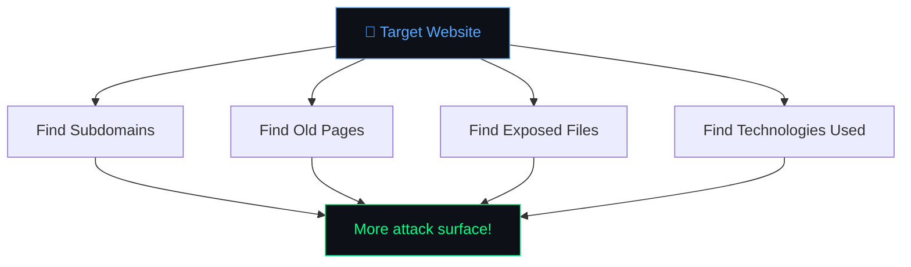
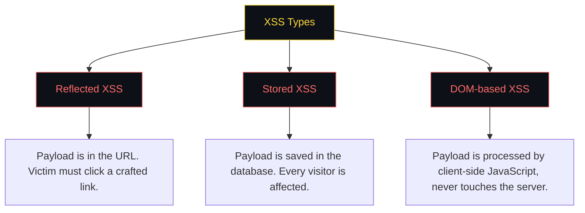

# 🟢 Day 1 — The Hacker Mindset

> **Topics:** Reconnaissance → SQL Injection → Cross-Site Scripting (XSS)

[← Back to Home](./README.md) · [Day 2 →](./Day-2.md)

---

## 🗺️ Today's Roadmap


```mermaid
graph LR
    A["🔍 Recon"] --> B["💉 SQL Injection"]
    B --> C["📜 XSS"]
    style A fill:#1a1a2e,stroke:#00ff88,color:#00ff88
    style B fill:#1a1a2e,stroke:#ff6b6b,color:#ff6b6b
    style C fill:#1a1a2e,stroke:#ffd93d,color:#ffd93d
```

---

## 🌐 What is Bug Bounty Hunting?

Companies invite hackers to **find and report security vulnerabilities** in their applications — and **pay real money** for valid findings.

```
┌──────────────────────────────────────────────────────────────────┐
│                    HOW BUG BOUNTY WORKS                          │
│                                                                  │
│   You (Hacker)          Company              Reward              │
│   ┌─────────┐          ┌─────────┐          ┌─────────┐          │
│   │ Find a  │  report  │ Verify  │  valid   │   Get   │          │ 
│   │  Bug    │ ───────► │ the Bug │ ───────► │  Paid!  │          │
│   └─────────┘          └─────────┘          └─────────┘          │
│                                                                  │
│   Real Payouts:                                                  │
│   • Low severity:     $50 – $500                                 │
│   • Medium severity:  $500 – $2,000                              │
│   • High severity:    $2,000 – $10,000                           │
│   • Critical:         $10,000 – $100,000+                        │
└──────────────────────────────────────────────────────────────────┘
```

### The OWASP Top 10

The **OWASP Top 10** is a list of the most critical web application security risks. Think of it as the "greatest hits" of web vulnerabilities:

| # | Vulnerability | What It Means |
|---|-------------|--------------|
| 1 | Broken Access Control | Accessing things you shouldn't |
| 2 | Cryptographic Failures | Weak or missing encryption |
| 3 | Injection | SQLi, XSS, Command Injection |
| 4 | Insecure Design | Flawed application logic |
| 5 | Security Misconfiguration | Default passwords, exposed files |
| 6 | Vulnerable Components | Using outdated libraries |
| 7 | Authentication Failures | Broken login/session systems |
| 8 | Data Integrity Failures | Insecure deserialization |
| 9 | Logging Failures | Not detecting attacks |
| 10 | SSRF | Server-Side Request Forgery |

> 📖 Full list: [owasp.org/www-project-top-ten](https://owasp.org/www-project-top-ten/)

---

## 🔍 Topic 1: Reconnaissance (Recon) 🟢 Easy

### What is Recon?

Reconnaissance is the **information gathering phase** — before you hack anything, you need to know what exists. It's like a burglar checking which doors and windows a house has before trying to break in.

> **"Give me six hours to chop down a tree and I will spend the first four sharpening the axe."** — Abraham Lincoln


```mermaid
graph TD
    A["🎯 Target Website"] --> B["Find Subdomains"]
    A --> C["Find Old Pages"]
    A --> D["Find Exposed Files"]
    A --> E["Find Technologies Used"]
    B --> F["More attack surface!"]
    C --> F
    D --> F
    E --> F
    style A fill:#0d1117,stroke:#58a6ff,color:#58a6ff
    style F fill:#0d1117,stroke:#00ff88,color:#00ff88
```

### Key Recon Techniques

#### 1. Subdomain Enumeration
Find hidden subdomains like `admin.example.com`, `staging.example.com`, `api.example.com`.

**Tool: crt.sh** — [https://crt.sh](https://crt.sh)

Try it now:
- Go to [crt.sh](https://crt.sh)
- Search for `%.tesla.com`
- See all the subdomains Tesla has!

#### 2. Google Dorking
Use advanced Google searches to find exposed information.

| Google Dork | What It Finds |
|------------|--------------|
| `site:example.com` | All indexed pages of a site |
| `site:example.com filetype:pdf` | All PDF files on the site |
| `site:example.com inurl:admin` | Admin pages |
| `site:example.com intitle:"index of"` | Directory listings (exposed files!) |
| `site:example.com ext:log \| ext:txt \| ext:conf` | Exposed config/log files |

#### 3. Fuzzing (Linux Demo)
Fuzzing means automatically sending lots of words/paths at a target to discover **hidden pages, directories, and files** that aren't linked anywhere.

> **Linux only**

**Tool: ffuf** — fast web fuzzer

```bash
# Find hidden directories on a target
ffuf -w /usr/share/wordlists/dirb/common.txt -u https://example.com/FUZZ

# Find hidden files with extensions
ffuf -w /usr/share/wordlists/dirb/common.txt -u https://example.com/FUZZ -e .php,.html,.txt
```

What happens: ffuf replaces `FUZZ` with every word in the wordlist and checks if the page exists. A `200 OK` response means the page is real — you've found something hidden!

**Common finds:** `/admin`, `/backup`, `/config.php`, `/.env`, `/api/v1`

#### More Tools

| Tool | Description |
|------|-------------|
| web.archive.org | [Wayback Machine](https://web.archive.org) (old site snapshots) |
| shodan.io | [Shodan](https://shodan.io) (internet-connected device search) |
| securitytrails.com | [SecurityTrails](https://securitytrails.com) (DNS & domain history) |
| Wappalyzer | [Wappalyzer](https://www.wappalyzer.com) (browser tech stack detector) |

### 🧪 Core Questions

> **Question 1 (crt.sh):**
> Go to [crt.sh](https://crt.sh) and search `%.example.com` (replace with any company).

> **Question 2 (Google Dorking):**
> Open Google and try: `site:github.com "password" filetype:env`.

### ➕ Extra Questions for Practice

1. **Wayback:** Check any website on [web.archive.org](https://web.archive.org) and find one old endpoint.
2. **Shodan:** Browse [shodan.io](https://shodan.io) and search for one exposed service.
3. **Wappalyzer:** Identify the tech stack of two websites.

---

## 💉 Topic 2: SQL Injection (SQLi) 🟡 Medium

### What is SQL Injection?

SQL (Structured Query Language) is the language used to talk to databases. When a website **takes your input and puts it directly into a database query**, you can manipulate that query.

### Mini Syntax Primer

For these labs, think in tiny SQL building blocks:

| Syntax | Meaning | Example |
|---|---|---|
| `'` | Closes the current text value | `admin'` |
| `OR` | Adds another condition to the `WHERE` clause | `' OR 1=1` |
| `=` | Compares two values | `'1'='1'` |
| `--` | Comments out the rest of the query | `--` |

Quick read of common payloads: `administrator'--` = close username + ignore password check. `' OR 1=1 --` = close value + add always-true condition + ignore remaining query.

### How It Works

Imagine a login form. Behind the scenes, the website runs:

```sql
SELECT * FROM users WHERE username = 'INPUT' AND password = 'INPUT'
```

If you type `admin' --` as the username:

```sql
SELECT * FROM users WHERE username = 'admin' --' AND password = 'anything'
```

The `--` is a SQL comment — it **ignores everything after it**, including the password check! 🎉

```
┌──────────────────────────────────────────────────────────────────┐
│                    SQL INJECTION — VISUALIZED                    │
│                                                                  │
│   Normal Login:                                                  │
│   ┌──────────────┐     ┌──────────────┐     ┌──────────────┐     │
│   │  Username:   │     │   SELECT *   │     │    Login     │     │
│   │  john        │ ──► │   WHERE      │ ──► │   Failed     │     │
│   │  Password:   │     │   user='john'│     │   (wrong pw) │     │
│   │  wrong123    │     │   AND pw=    │     │              │     │
│   └──────────────┘     │   'wrong123' │     └──────────────┘     │
│                        └──────────────┘                          │
│                                                                  │
│   Injected Login:                                                │
│   ┌──────────────┐     ┌──────────────┐     ┌──────────────┐     │
│   │  Username:   │     │   SELECT *   │     │    Login     │     │
│   │  admin' --   │ ──► │   WHERE      │ ──► │   Success!   │     │
│   │  Password:   │     │   user=      │     │   (password  │     │
│   │  anything    │     │   'admin'    │     │    skipped!) │     │
│   └──────────────┘     └──────────────┘     └──────────────┘     │
└──────────────────────────────────────────────────────────────────┘
```

### Common SQL Injection Payloads

| Payload | What It Does |
|---------|-------------|
| `' OR 1=1 --` | Always true → bypasses login |
| `' UNION SELECT null,null --` | Extracts data from other tables |
| `' OR '1'='1` | Another always-true condition |
| `admin' --` | Logs in as admin, skips password |

### 🎬 Try It Locally

Open [demos/sqli-login/](./demos/sqli-login/) in your browser — a tiny vulnerable login form that shows you the SQL query building live as you type. Great way to build intuition before the lab.

### 🧪 Core Questions — 3 Questions

> **Do these 3 questions in order. We'll walk through Questions together.**

#### Questions 1-3 (PortSwigger)

| # | Lab | What You'll Learn | Link |
|---|-----|------------------|------|
| 1 | **SQL injection — retrieving hidden data** | Use `' OR 1=1 --` to see hidden products | [🔗 Start Lab](https://portswigger.net/web-security/sql-injection/lab-retrieve-hidden-data) |
| 2 | **SQL injection — login bypass** | Log in as administrator without a password | [🔗 Start Lab](https://portswigger.net/web-security/sql-injection/lab-login-bypass) |
| 3 | **SQL injection UNION attack — finding columns** | Use UNION to extract data from other tables | [🔗 Start Lab](https://portswigger.net/web-security/sql-injection/union-attacks/lab-determine-number-of-columns) |

<details>
<summary>💡 Hint for Lab 1</summary>

The product category filter is vulnerable. Try modifying the URL or the category parameter:
```
' OR 1=1 --
```
This makes the WHERE clause always true, showing ALL products including hidden ones.
</details>

<details>
<summary>💡 Hint for Lab 2</summary>

In the login page, try this as the username:
```
administrator'--
```
This closes the username string and comments out the password check.
</details>

<details>
<summary>💡 Hint for Lab 3 (UNION)</summary>

Use `ORDER BY` to find the number of columns:
```
' ORDER BY 1--
' ORDER BY 2--
' ORDER BY 3--
```
Keep increasing until you get an error — that tells you the column count. Then use:
```
' UNION SELECT NULL,NULL,NULL--
```
(Match the number of NULLs to the column count)
</details>

### ➕ Extra Questions for Practice

1. Re-run the login bypass lab and write what each symbol in `administrator'--` does.
2. In the UNION lab, test `ORDER BY 1--`, `ORDER BY 2--`, `ORDER BY 3--` until error, then note the final column count.
3. Pick one more SQLi lab from PortSwigger Academy and solve it.

### 📖 Want to Learn More?
- [PortSwigger — SQL Injection Explained](https://portswigger.net/web-security/sql-injection)
- [SQL Injection Cheat Sheet](https://portswigger.net/web-security/sql-injection/cheat-sheet)

---

## 📜 Topic 3: Cross-Site Scripting (XSS) 🟡 Medium

### What is XSS?

XSS is when an attacker **injects JavaScript code** into a web page that other users visit. The injected code runs in the victim's browser, which means the attacker can:

- 🍪 Steal cookies/session tokens
- 🔓 Hijack user accounts
- 🎭 Deface the website
- 🔀 Redirect users to malicious sites

### Mini Syntax Primer

Most XSS payloads are just basic HTML + JavaScript combined:

| Syntax | Meaning | Example |
|---|---|---|
| `<tag>...</tag>` | Normal HTML element structure | `<script>alert(1)</script>` |
| `onerror=` | Runs JavaScript when an element fails to load | `` |
| `function(value)` | Basic JavaScript function-call format | `alert(1)` |
| `">` | Breaks out of an HTML attribute context | `"><script>alert(1)</script>` |

Rule of thumb: first identify the input context (HTML body, attribute, or script), then use a payload that matches that context.

### The 3 Types of XSS


```mermaid
graph TD
    A["XSS Types"] --> B["Reflected XSS"]
    A --> C["Stored XSS"]
    A --> D["DOM-based XSS"]
    B --> B1["Payload is in the URL. Victim must click a crafted link."]
    C --> C1["Payload is saved in the database. Every visitor is affected."]
    D --> D1["Payload is processed by client-side JavaScript, never touches the server."]
    style A fill:#0d1117,stroke:#ffd93d,color:#ffd93d
    style B fill:#0d1117,stroke:#ff6b6b,color:#ff6b6b
    style C fill:#0d1117,stroke:#ff6b6b,color:#ff6b6b
    style D fill:#0d1117,stroke:#ff6b6b,color:#ff6b6b
```

### How It Works — Reflected XSS Example

Imagine a search page that displays: "You searched for: **[your input]**"

```
URL: https://example.com/search?q=hello
Page shows: "You searched for: hello"

URL: https://example.com/search?q=<script>alert('XSS')</script>
Page shows: "You searched for: " ...and runs the script! 💥
```

```
┌──────────────────────────────────────────────────────────────────┐
│                    XSS ATTACK FLOW                               │
│                                                                  │
│   Attacker                  Victim                   Server      │
│   ┌───────┐               ┌───────┐               ┌───────┐      │
│   │Crafts │  sends link   │Clicks │   request     │Returns│      │
│   │evil   │ ────────────► │the    │ ────────────► │page + │      │
│   │link   │               │link   │               │script │      │
│   └───────┘               └───────┘               └───┬───┘      │
│                                │                       │         │
│                                │◄──────────────────────┘         │
│                                │  page loads with                │
│                                │  attacker's JavaScript          │
│                                │                                 │
│                                ▼                                 │
│                           ┌─────────┐                            │
│                           │ Cookie  │                            │
│                           │ Stolen! │                            │
│                           │ 🍪 → 😈│                            │
│                           └─────────┘                            │
└──────────────────────────────────────────────────────────────────┘
```

### Common XSS Payloads

| Payload | Use Case |
|---------|----------|
| `<script>alert('XSS')</script>` | Classic test to see if XSS works |
| `` | Works when `<script>` is blocked |
| `<svg onload=alert('XSS')>` | Another bypass technique |
| `"><script>alert('XSS')</script>` | Breaking out of an HTML attribute |

### 🎬 Try It Locally

Open [demos/xss-search/](./demos/xss-search/) — a vulnerable search box that echoes input via `innerHTML`. Try `` and see the browser render it live.

### 🧪 Core Questions

#### Questions 1-3 (PortSwigger)

| # | Lab | What You'll Learn | Link |
|---|-----|------------------|------|
| 1 | **Reflected XSS into HTML context** | Inject a simple script via search | [🔗 Start Lab](https://portswigger.net/web-security/cross-site-scripting/reflected/lab-html-context-nothing-encoded) |
| 2 | **Stored XSS into HTML context** | Post a comment with embedded JavaScript | [🔗 Start Lab](https://portswigger.net/web-security/cross-site-scripting/stored/lab-html-context-nothing-encoded) |
| 3 | **DOM XSS in `document.write` sink** | Exploit client-side JavaScript that writes to the page | [🔗 Start Lab](https://portswigger.net/web-security/cross-site-scripting/dom-based/lab-document-write-sink) |

### ➕ Extra Questions for Practice

#### Google XSS Game (Fun & Visual) 🎮

| Level | Challenge | Link |
|-------|----------|------|
| All Levels | Solve XSS challenges 1–6 | [🔗 Play Now](https://xss-game.appspot.com) |

Try to complete at least **levels 1-3** after class.

<details>
<summary>💡 Hint for Reflected XSS Lab</summary>

The search box drops your input straight into the HTML with no sanitisation. The server is doing something like:
```php
echo "<p>You searched for: " . $_GET['q'] . "</p>";
```
The page doesn't block anything, so the classic payload works directly:
```html
<script>alert(1)</script>
```
Check the URL bar — your payload is right there in `?search=...`. That's the "reflected" part — it bounced off the server back into the page.
</details>

<details>
<summary>💡 Hint for Stored XSS Lab</summary>

Go to a blog post and leave a comment. The server saves your comment to a database and on every page load does:
```php
echo "<p>" . $row['comment'] . "</p>";
```
Because the page loads fresh (not injected via innerHTML), `<script>` tags actually execute here:
```html
<script>alert(1)</script>
```
After posting, reload the page — the alert fires on load. Every visitor who opens the page gets hit, not just you.
</details>

<details>
<summary>💡 Hint for DOM XSS Lab</summary>

This one never touches the server. The page has client-side JavaScript doing:
```javascript
document.write('');
```
Your input goes into `document.write` — which does execute `<script>` tags. Break out of the `src` attribute first, then inject:
```html
"><script>alert(1)</script>
```
Open DevTools → Sources, find the JS file, and look for the `document.write` line — the browser itself is running the vulnerable code.
</details>

### 📖 Want to Learn More?
- [PortSwigger — XSS Explained](https://portswigger.net/web-security/cross-site-scripting)
- [XSS Cheat Sheet](https://portswigger.net/web-security/cross-site-scripting/cheat-sheet)

---

## 📝 Day 1 — Summary

```
✅ Recon         — How to find attack surfaces using crt.sh, Google Dorks, Wayback Machine
✅ SQL Injection — How to manipulate database queries through user input
✅ XSS           — How to inject JavaScript into web pages
```

### 🏠 Homework

1. Complete **2 extra recon questions** from the "Extra Questions for Practice" list.
2. Complete one extra SQLi lab on PortSwigger and write down the payload that solved it.
3. Complete **Google XSS Game levels 1-3**: [xss-game.appspot.com](https://xss-game.appspot.com).

---

<p align="center">
  <a href="./Day-2.md"><b>Continue to Day 2 → Server-Side Attacks</b></a>
</p>
