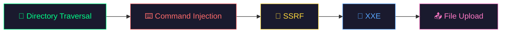
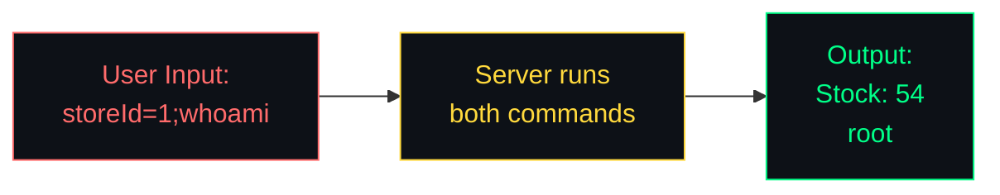
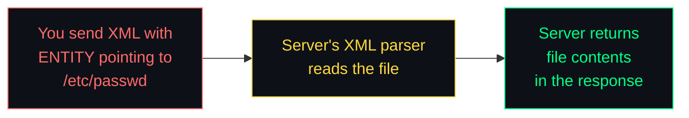

# 🟡 Day 2 — Server-Side Attacks

> **Topics:** Directory Traversal → Command Injection → SSRF → XXE → File Upload

[← Day 1](./Day-1.md) · [Back to Home](./README.md) · [Day 3 →](./Day-3.md)

---

## 🗺️ Today's Roadmap



### Yesterday vs. Today

| Day 1 | Day 2 |
|-------|-------|
| Attacked the **client side** (browser) | Attacking the **server side** |
| Injected into SQL queries and HTML | Making the server read files, run commands, send requests |
| Impact: Data theft, account hijacking | Impact: Full server compromise 💀 |

> Server-side bugs are typically **higher severity** = **higher bounty payouts** 💰

---

---

<!-- ⏱️ INSTRUCTOR: ~30 min (10 min theory + 20 min labs) -->
## 📁 Topic 1: Directory Traversal (Path Traversal) 🟢 Easy

### What Is It?

When a website loads a file (like an image or document), it uses a file path on the server. If it doesn't **validate** the path properly, you can navigate to files **outside** the intended directory.

### How It Works

```
Normal Request:
GET /image?file=photo.jpg
Server reads: /var/www/images/photo.jpg  ✅

Malicious Request:
GET /image?file=../../../etc/passwd
Server reads: /var/www/images/../../../etc/passwd
           = /etc/passwd  💀
```

```
┌──────────────────────────────────────────────────────────────────┐
│              DIRECTORY TRAVERSAL — VISUALIZED                    │
│                                                                  │
│   Server File System:                                            │
│                                                                  │
│   /                                                              │
│   ├── etc/                                                       │
│   │   └── passwd         ◄─── 🎯 Attacker wants this!           │
│   ├── var/                                                       │
│   │   └── www/                                                   │
│   │       └── images/    ◄─── 📂 Website reads from here         │
│   │           ├── cat.jpg                                        │
│   │           └── dog.jpg                                        │
│   └── ...                                                        │
│                                                                  │
│   ../../../etc/passwd                                            │
│   ─┬─ ─┬─ ─┬─                                                   │
│    │   │   └── Go up from images/ to www/                        │
│    │   └────── Go up from www/ to var/                            │
│    └────────── Go up from var/ to /                               │
│                Then go into etc/ and read passwd                  │
└──────────────────────────────────────────────────────────────────┘
```

### Common Payloads

| Payload | Target |
|---------|--------|
| `../../../etc/passwd` | Linux user file |
| `..\..\..\..\windows\win.ini` | Windows system file |
| `....//....//....//etc/passwd` | Bypass basic `../` stripping |
| `%2e%2e%2f%2e%2e%2f` | URL-encoded version of `../../` |

### 🧪 Hands-On Labs

| # | Lab | What You'll Learn | Link |
|---|-----|------------------|------|
| 1 | **File path traversal, simple case** | Use `../` to read `/etc/passwd` | [🔗 Start Lab](https://portswigger.net/web-security/file-path-traversal/lab-simple) |
| 2 | **Traversal sequences stripped non-recursively** | Bypass a basic filter | [🔗 Start Lab](https://portswigger.net/web-security/file-path-traversal/lab-sequences-stripped-non-recursively) |

<details>
<summary>💡 Hint for Lab 1</summary>

Click on any product image. Look at the `GET` request in your browser's Network tab — you'll see something like `?filename=image.jpg`. Replace the filename with:
```
../../../etc/passwd
```
</details>

<details>
<summary>💡 Hint for Lab 2</summary>

The server strips `../` from your input, but only once! So use:
```
....//....//....//etc/passwd
```
When the server removes `../`, what's left is still `../../../etc/passwd` 🧠
</details>

### 📖 Learn More
- [PortSwigger — Path Traversal](https://portswigger.net/web-security/file-path-traversal)

---

---

<!-- ⏱️ INSTRUCTOR: ~40 min (15 min theory + 25 min labs) -->
## ⌨️ Topic 2: OS Command Injection 🟡 Medium

### What Is It?

Some websites run **operating system commands** on the server based on user input. If the input isn't properly sanitized, you can **inject additional commands**.

### How It Works

Imagine a website with a "Check Stock" feature that runs a lookup command on the server.

If you inject `; whoami` into the store ID field, the server runs **two commands**: the stock check AND `whoami` (which reveals the server's username)!



### Command Injection Operators

| Operator | How It Works |
|----------|-------------|
| `;` | Run both commands sequentially |
| `\|` | Pipe output of first command to second |
| `&&` | Run second command only if first succeeds |
| `\|\|` | Run second command only if first fails |
| `$()` | Execute command inside parentheses first |

### 🧪 Hands-On Labs

| # | Lab | What You'll Learn | Link |
|---|-----|------------------|------|
| 1 | **OS command injection, simple case** | Inject a command via a product stock checker | [🔗 Start Lab](https://portswigger.net/web-security/os-command-injection/lab-simple) |
| 2 | **Blind OS command injection with time delays** | Detect injection via ping time delay | [🔗 Start Lab](https://portswigger.net/web-security/os-command-injection/lab-blind-time-delays) |

<details>
<summary>💡 Hint for Lab 1</summary>

Open a product, click "Check Stock", and intercept the request. The `storeId` parameter is vulnerable. Append a command separator followed by `whoami` to the storeId value.
</details>

<details>
<summary>💡 Hint for Lab 2 (Blind)</summary>

You won't see output directly. Instead, cause a **time delay** to prove the injection works. Use a ping command with a 10-second count. If the response takes ~10 seconds, you've confirmed command injection!
</details>

### 📖 Learn More
- [PortSwigger — OS Command Injection](https://portswigger.net/web-security/os-command-injection)

---

---

<!-- ⏱️ INSTRUCTOR: ~45 min (20 min theory + 25 min labs) -->
## 🔄 Topic 3: Server-Side Request Forgery (SSRF) 🟡 Medium

### What Is It?

SSRF tricks the **server** into making HTTP requests on your behalf. This lets you:
- Access **internal services** that are not exposed to the internet
- Read **cloud metadata** (AWS keys, configs)
- Scan the **internal network**

### How It Works

```
Normal:
You ──► Server ──► external-api.com    (intended behavior)

SSRF:
You ──► Server ──► localhost:8080/admin  (accessing internal admin panel!)
You ──► Server ──► 169.254.169.254      (reading cloud credentials!)
```

```
┌──────────────────────────────────────────────────────────────────┐
│                     SSRF — VISUALIZED                            │
│                                                                  │
│   Internet                 │           Internal Network          │
│   ─────────                │          ─────────────────          │
│                            │                                     │
│   ┌───────┐    request     │  ┌─────────┐     ┌──────────┐     │
│   │  You  │ ─────────────► │  │  Web    │ ──► │  Admin   │     │
│   │       │    "check      │  │  Server │     │  Panel   │     │
│   └───────┘   this URL"    │  └─────────┘     │ (secret!)│     │
│                            │       │          └──────────┘     │
│   🔒 You can't access     │       │                            │
│   the admin panel directly │       ▼                            │
│                            │  ┌──────────┐                      │
│   But the SERVER can! ──── │  │ Database │                      │
│   And you control what     │  │ (secret!)│                      │
│   URL it visits! 😈        │  └──────────┘                      │
└──────────────────────────────────────────────────────────────────┘
```

### Common SSRF Targets

| Target URL | What You Get |
|-----------|-------------|
| `http://localhost/admin` | Internal admin panel |
| `http://127.0.0.1:8080` | Internal services on the same machine |
| `http://192.168.0.x` | Other machines on the internal network |
| `http://169.254.169.254/latest/meta-data/` | AWS cloud credentials ☁️ |

### 🧪 Hands-On Labs

| # | Lab | What You'll Learn | Link |
|---|-----|------------------|------|
| 1 | **Basic SSRF against the local server** | Access admin panel via localhost | [🔗 Start Lab](https://portswigger.net/web-security/ssrf/lab-basic-ssrf-against-localhost) |
| 2 | **Basic SSRF against another back-end system** | Scan internal IP range to find hidden services | [🔗 Start Lab](https://portswigger.net/web-security/ssrf/lab-basic-ssrf-against-backend-system) |

<details>
<summary>💡 Hint for Lab 1</summary>

Click "Check Stock" on any product and intercept the request. You'll see a `stockApi` parameter with a URL. Replace it with `http://localhost/admin` — you'll access the admin panel that's normally hidden!
</details>

<details>
<summary>💡 Hint for Lab 2</summary>

Same idea, but the admin panel is on a different internal machine. You need to scan the `192.168.0.X` range (change X from 1 to 255) to find which IP has the admin panel on port 8080. Keep changing the last number until you get a response!
</details>

### 📖 Learn More
- [PortSwigger — SSRF](https://portswigger.net/web-security/ssrf)

---

---

<!-- ⏱️ INSTRUCTOR: ~40 min (15 min theory + 25 min labs) -->
## 📄 Topic 4: XML External Entity Injection (XXE) 🔴 Hard

### What Is It?

**XML** is a data format (like JSON). XXE happens when an application **parses XML input** and allows the definition of **external entities** — which can reference local files or internal URLs.

### How It Works

Normal XML sends structured data. But by defining an **external entity**, you can make the XML parser read server files:

```
1. Define an entity that points to a file:  file:///etc/passwd
2. Reference that entity in the XML data
3. The server's XML parser reads the file and includes it in the response!
```



> 📖 See the exact XML payload in the [PortSwigger XXE guide](https://portswigger.net/web-security/xxe)

### 🧪 Hands-On Labs

| # | Lab | What You'll Learn | Link |
|---|-----|------------------|------|
| 1 | **Exploiting XXE to retrieve files** | Read `/etc/passwd` via XXE | [🔗 Start Lab](https://portswigger.net/web-security/xxe/lab-exploiting-xxe-to-retrieve-files) |
| 2 | **Exploiting XXE to perform SSRF** | Use XXE to make the server send internal requests | [🔗 Start Lab](https://portswigger.net/web-security/xxe/lab-exploiting-xxe-to-perform-ssrf) |

<details>
<summary>💡 Hint for Lab 1</summary>

Click "Check Stock" and intercept the request. You'll see XML data being sent. Add a DOCTYPE declaration with an ENTITY pointing to `file:///etc/passwd`, then reference that entity in one of the XML elements. The response will contain the file contents!
</details>

<details>
<summary>💡 Hint for Lab 2</summary>

Same approach as Lab 1, but instead of reading a local file, point the ENTITY to an internal HTTP URL like the AWS metadata endpoint. This combines XXE with SSRF!
</details>

### 📖 Learn More
- [PortSwigger — XXE](https://portswigger.net/web-security/xxe)

---

---

<!-- ⏱️ INSTRUCTOR: ~30 min (10 min theory + 20 min lab) -->
## 📤 Topic 5: File Upload Vulnerabilities 🟡 Medium

### What Is It?

Many websites allow file uploads (profile pictures, documents). If the server doesn't properly validate **what you upload**, you can upload a **malicious file** (like a server-side script) and execute code on the server.

### How It Works

```
┌──────────────────────────────────────────────────────────────────┐
│              FILE UPLOAD ATTACK — VISUALIZED                     │
│                                                                  │
│   Step 1: Upload malicious file                                  │
│   ┌─────────────┐          ┌─────────────┐                      │
│   │  Upload a   │  upload  │  Server     │                      │
│   │  server     │ ───────► │  saves it   │                      │
│   │  script     │          │  to /files/ │                      │
│   │  as avatar  │          │             │                      │
│   └─────────────┘          └─────────────┘                      │
│                                                                  │
│   Step 2: Visit the uploaded file                                │
│   ┌─────────────┐          ┌─────────────┐                      │
│   │  Visit the  │  GET     │  Server     │                      │
│   │  uploaded   │ ───────► │  EXECUTES   │                      │
│   │  file URL   │          │  your code! │                      │
│   └─────────────┘          └──────┬──────┘                      │
│                                   │                              │
│                                   ▼                              │
│                            ┌─────────────┐                      │
│                            │  💀 Remote  │                      │
│                            │    Code     │                      │
│                            │  Execution! │                      │
│                            └─────────────┘                      │
└──────────────────────────────────────────────────────────────────┘
```

### Key Concept

If you can upload a server-side script (like a .php file) and the server executes it when accessed, you can run arbitrary commands on the server. This is called a **web shell**.

> 📖 The exact payloads and web shell examples are covered in the [PortSwigger File Upload guide](https://portswigger.net/web-security/file-upload)

### 🧪 Hands-On Lab

| # | Lab | What You'll Learn | Link |
|---|-----|------------------|------|
| 1 | **Remote code execution via web shell upload** | Upload a script and execute commands on the server | [🔗 Start Lab](https://portswigger.net/web-security/file-upload/lab-file-upload-remote-code-execution-via-web-shell-upload) |

<details>
<summary>💡 Hint</summary>

1. Log in with `wiener:peter`
2. Go to "My Account" and find the avatar upload feature
3. Instead of an image, upload a server-side script that reads the contents of `/home/carlos/secret`
4. Right-click your avatar and open the image URL in a new tab
5. The server executes the script and reveals the secret!

> The PortSwigger lab solution page has the exact payload if you get stuck.
</details>

### 📖 Learn More
- [PortSwigger — File Upload](https://portswigger.net/web-security/file-upload)

---

---

## ⚠️ Common Mistakes to Avoid

| Mistake | Fix |
|---------|-----|
| Only trying `../` without encoding | Try URL-encoding (`%2e%2e%2f`), double-encoding, and `....//` variants |
| Forgetting to try all command separators | Don't just try `;` — also try `|`, `&&`, `||`, and `$()` |
| Using wrong IP for SSRF | `localhost` and `127.0.0.1` are treated differently by some filters — try both |
| Not intercepting the actual request | Use browser DevTools Network tab to see the real parameters being sent |
| Uploading files with wrong extension | The server checks the extension — try `.php`, `.php5`, `.phtml`, `.phar` variants |
| Skipping XXE because it looks complex | XXE follows a simple pattern — just swap the entity target. Practice the first lab! |

---

## 📝 Day 2 — Summary

```
✅ Directory Traversal   — Read sensitive files using ../
✅ Command Injection     — Execute OS commands on the server
✅ SSRF                  — Make the server send requests to internal systems
✅ XXE                   — Exploit XML parsers to read files
✅ File Upload           — Upload scripts for remote code execution
```

### 🏠 Homework (Optional but Recommended)

1. Complete **1 more lab** from any of today's topics on [PortSwigger](https://portswigger.net/web-security)
2. Try the [OWASP Juice Shop](https://juice-shop.herokuapp.com) — look for file upload and XXE challenges

---

<p align="center">
  <a href="./Day-3.md"><b>Continue to Day 3 → Real World Hunting</b></a>
</p>
