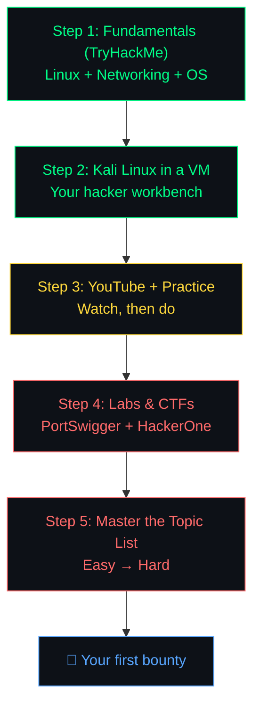

# 🗺️ Future Roadmap — From Workshop Graduate to Bug Bounty Hunter

> You've finished the 3-day workshop. **Now what?**
>
> This roadmap is the path we recommend — built from the workshop, public community roadmaps ([TryHackMe 500+ rooms](https://github.com/owyand/TryHackMe-Roadmap-April-2026), [Netlas 2026 Bug Bounty Roadmap](https://netlas.io/blog/bug_bounty_roadmap/), [TCM Security's "How to Be an Ethical Hacker"](https://tcm-sec.com/how-to-be-an-ethical-hacker-in-2025/)), and the [OWASP Top 10](https://owasp.org/www-project-top-ten/).

[← Back to Home](./README.md)

---

## 📋 The Roadmap at a Glance



**Rough time commitment:** ~10–15 hours/week for ~6 months to your first real bug. Some get there faster, most take longer. Keep going.

---

## 🟢 Step 1 — Fundamentals via TryHackMe (THM)

**Why:** Before you attack applications, you must understand the systems underneath — how Linux works, how HTTP and DNS move data, what a port is. Skip this and every attack you learn feels like magic.

**Sign up:** [tryhackme.com/signup](https://tryhackme.com/signup) (free tier is plenty for this step)

### Must-do rooms (in order)

| # | Room | Topic | Link |
|---|------|-------|------|
| 1 | **Introduction to Cyber Security** | Field overview | [🔗 Open](https://tryhackme.com/module/introduction-to-cyber-security) |
| 2 | **Linux Fundamentals (Part 1)** | `cd`, `ls`, `cat`, basic shell | [🔗 Open](https://tryhackme.com/room/linuxfundamentalspart1) |
| 3 | **Linux Fundamentals (Part 2)** | Permissions, SSH, package managers | [🔗 Open](https://tryhackme.com/room/linuxfundamentalspart2) |
| 4 | **Linux Fundamentals (Part 3)** | Editors, cron, logs | [🔗 Open](https://tryhackme.com/room/linuxfundamentalspart3) |
| 5 | **Intro to Networking** | OSI, TCP/IP, packets | [🔗 Open](https://tryhackme.com/room/introtonetworking) |
| 6 | **Network Services** | Enumeration of SMB, Telnet, FTP | [🔗 Open](https://tryhackme.com/room/networkservices) |
| 7 | **Web Fundamentals** | HTTP, headers, cookies, requests | [🔗 Open](https://tryhackme.com/room/webfundamentals) |
| 8 | **Windows Fundamentals 1** | Files, registry, task manager | [🔗 Open](https://tryhackme.com/room/windowsfundamentals1xbx) |
| 9 | **Nmap** | Network scanning 101 | [🔗 Open](https://tryhackme.com/room/furthernmap) |
| 10 | **Burp Suite: The Basics** | The tool you'll use forever | [🔗 Open](https://tryhackme.com/room/burpsuitebasics) |

### Structured paths (pick one)

- [**Pre Security**](https://tryhackme.com/path/outline/presecurity) — zero-to-beginner; complete this if THM is your first exposure to IT
- [**Jr Penetration Tester**](https://tryhackme.com/path/outline/jrpenetrationtester) — the natural next path once you've done the rooms above
- [**Complete 500+ Room Roadmap (community-curated)**](https://github.com/owyand/TryHackMe-Roadmap-April-2026) — if you want a massive catalog by topic

> 🎯 **Goal for this step:** By the end, you can explain how a request travels from your browser to a server and back, navigate Linux comfortably, and run a basic Nmap scan without looking anything up.

---

## 🐉 Step 2 — Kali Linux Setup (Virtual Machine)

**Why:** Kali is the de-facto hacker OS — it ships with hundreds of tools pre-installed (Burp, nmap, sqlmap, metasploit, gobuster…) and is what every tutorial assumes you have. Running it inside a **VM** means you get all that without touching your main OS — if Kali breaks, you just reset a snapshot.

### The 10-minute path (pre-made VM — recommended)

This is the official, easiest route. No ISO, no manual install.

1. **Install a hypervisor** — pick one:
   - [VirtualBox](https://www.virtualbox.org/wiki/Downloads) (free, all platforms)
   - [VMware Workstation Player](https://www.vmware.com/products/workstation-player.html) (free for personal use, Windows/Linux)
2. **Download the pre-made Kali VM** from [kali.org/get-kali](https://www.kali.org/get-kali/#kali-virtual-machines) — pick the one matching your hypervisor
3. **Follow the official import guide:**
   - [Import Pre-Made Kali VirtualBox VM](https://www.kali.org/docs/virtualization/import-premade-virtualbox/)
   - [Import Pre-Made Kali VMware VM](https://www.kali.org/docs/virtualization/import-premade-vmware/)
4. **Start it up.** Default credentials are `kali` / `kali`. Change the password immediately (`passwd`).

### Recommended VM specs

| Resource | Minimum | Comfortable |
|----------|---------|-------------|
| RAM | 2 GB | 4–8 GB |
| Disk | 20 GB | 40 GB |
| CPU | 2 cores | 4 cores |

Your host machine needs CPU virtualization (VT-x / AMD-V) enabled in BIOS. Most modern laptops have this on by default.

### First-boot checklist

```bash
sudo apt update && sudo apt upgrade -y     # bring everything current
sudo apt install -y burpsuite ffuf gobuster nikto sqlmap
burpsuite &                                # confirm GUI works
```

Take a **VM snapshot now** — if anything breaks later, revert to this clean slate.

### 📖 More detailed guides

- [Official Kali Docs — Virtualization](https://www.kali.org/docs/virtualization/)
- [Nucamp — Kali for Beginners 2026](https://www.nucamp.co/blog/kali-linux-for-beginners-in-2026-setup-safety-and-your-first-tools)
- [SecurityElites — Kali Installation 2026](https://securityelites.com/kali-linux-installation-guide-2026/)

---

## 🎥 Step 3 — YouTube Channels + Active Practice

**Why:** Written guides teach syntax. Video walkthroughs teach **thinking** — you watch a real hunter hit a dead end, reason through it, pivot, and win. That's the skill you're building.

**Rule:** **Don't passively watch.** Pause the video, try the step yourself, then resume. If you're not typing while you watch, you're not learning.

### The three channels to follow

| Channel | What You'll Get | Link |
|---------|-----------------|------|
| **Ryan John** | Bug bounty walkthroughs and real-target hunting flow | [🔗 YouTube](https://www.youtube.com/results?search_query=Ryan+John+bug+bounty) |
| **The Cyber Mentor** (Heath Adams / TCM Security) | Practical Ethical Hacking — the most-watched beginner-to-professional course on YouTube | [🔗 YouTube](https://www.youtube.com/@TCMSecurityAcademy) |
| **PwnFunction** | Web vulnerabilities explained with beautiful animations — the best "I finally get it" channel | [🔗 YouTube](https://www.youtube.com/@PwnFunction) |

### How to watch

- **PwnFunction first** for each topic — get the visual intuition
- **TCM** for the long-form, hands-on course treatment (his 12-hour Practical Ethical Hacking course is the gold standard)
- **Ryan John** to see bug bounty as it actually happens on live targets

> 💡 Keep a notebook (paper or Notion) while you watch. Write down payloads you haven't seen, techniques that surprised you, and tools worth trying.

---

## 🧪 Step 4 — Labs and CTFs

**Why:** Video teaches you the shape of an attack. Labs teach you the **fingertips** of it — what it feels like to stare at a request for 20 minutes and finally see the bypass.

### Primary platforms

| Platform | What It Is | Link |
|----------|------------|------|
| **PortSwigger Web Security Academy** | The single best web-app lab on the internet. Every OWASP Top 10 topic has 5–30 labs from easy to expert. Free. | [🔗 Start](https://portswigger.net/web-security) |
| **Hacker101 CTF** | HackerOne's free CTF. Realistic web targets with invite codes to private programs as rewards. | [🔗 Start](https://ctf.hacker101.com/) |
| **TryHackMe (continued)** | Rooms like **Pickle Rick**, **RootMe**, and **OWASP Top 10** rooms — full attack chains end to end. | [🔗 Start](https://tryhackme.com) |

### Practice flow

1. Pick one topic (say, SQLi)
2. Do **every lab** on PortSwigger for that topic — easy through expert
3. Do the matching Hacker101 CTF challenge
4. **Write a short note** for each: what the bug was, what payload solved it, what you'd search for on a real target

> 🤷 **Stuck? YouTube is your friend.** Every PortSwigger lab has a walkthrough on YouTube — search `"PortSwigger <exact lab title>"`. Watch just enough to unblock, then come back and finish it yourself. **Never** watch a full walkthrough before trying the lab for at least 30 minutes.

### Keep a "hunter's journal"

For every lab you solve, log:

```
Date:           2026-04-17
Target:         PortSwigger — SQL injection UNION attack, retrieving data
Vuln:           SQLi, UNION-based
Payload:        ' UNION SELECT username, password FROM users--
Time to solve:  25 min
What I learned: ORDER BY to find column count; first-column type mattered
```

After 30 of these, you'll notice your speed doubles.

---

## 📚 Step 5 — The Topic List (Easy → Hard)

Sourced from: [OWASP Top 10](https://owasp.org/www-project-top-ten/), [OWASP WSTG](https://owasp.org/www-project-web-security-testing-guide/), [PortSwigger Academy topics](https://portswigger.net/web-security/all-topics), [Netlas 2026 roadmap](https://netlas.io/blog/bug_bounty_roadmap/), [dev.to 2026 bug bounty guide](https://dev.to/krlz/bug-bounty-hunting-guide-2026-from-zero-to-paid-security-researcher-5c82), and community-written paths.

✅ = already covered in this workshop.

### 🟢 Level 1 — Beginner (start here)

#### ✅ Reconnaissance
Finding what actually exists before you try to attack anything — subdomains, old pages, exposed files, tech stack. Good recon is what separates hunters who find bugs from hunters who don't. Tools: `crt.sh`, Google Dorks, Wayback Machine, `ffuf`. *(Day 1)*

#### ✅ SQL Injection (SQLi)
Websites build database queries from your input. If they glue your text straight into the query, you can rewrite the query to skip logins or dump entire databases. One of the oldest and still one of the most rewarding bugs. *(Day 1)*

#### ✅ Cross-Site Scripting (XSS)
Injecting JavaScript into a page other people visit. When it works, your code runs in their browser with their session — you can steal cookies, impersonate them, or deface the page. Three flavors: reflected, stored, DOM-based. *(Day 1)*

#### ✅ Directory / Path Traversal
Asking a server for a file it wasn't meant to give you — using `../` to escape the intended directory. Leads to reading source code, configs, secret keys, and occasionally `/etc/passwd`. *(Day 2)*

#### ✅ IDOR (Insecure Direct Object Reference)
Changing an ID in a URL or request (`/orders/1001` → `/orders/1002`) and seeing someone else's data — because the server checks "are you logged in?" but not "does this belong to you?" The single best starter bug in real bounties. *(Day 3)*

#### ✅ CSRF (Cross-Site Request Forgery)
Tricking a logged-in user's browser into firing a state-changing request at a site without their knowledge. Works because the browser auto-attaches cookies. Defenses: CSRF tokens, SameSite cookies. *(Day 3)*

#### Information Disclosure
Finding things that shouldn't be public: debug pages, `.git` folders, stack traces, error messages, exposed admin panels. Needs no payload — just curiosity and recon.

#### Open Redirect
A site takes a URL parameter and redirects you there. If it doesn't check the destination, attackers use the trusted domain to launch phishing links. Low severity on its own, but a great chain ingredient.

### 🟡 Level 2 — Intermediate

#### ✅ OS Command Injection
The server runs shell commands built from your input. If you can sneak in `;`, `|`, or `&&`, you run your own commands — often as root. Jumps the kill chain from "I have a browser" to "I have a shell." *(Day 2)*

#### ✅ SSRF (Server-Side Request Forgery)
Making the server fetch a URL you control — including internal-only URLs like `localhost:8080/admin` or cloud metadata endpoints. Cloud environments are especially vulnerable; a working SSRF in AWS can dump IAM credentials. *(Day 2)*

#### ✅ JWT Attacks
JSON Web Tokens are everywhere for authentication. If the server trusts the token's claimed algorithm, or doesn't check the signature, you can forge tokens for any user — including admins. *(Day 3)*

#### Authentication Flaws
Password-reset that leaks tokens, 2FA that can be skipped, rate-limiting that doesn't apply to the login endpoint, session IDs that don't rotate after login. Each is a specific logic bug in the auth flow.

#### File Upload Vulnerabilities
If a site lets you upload files and doesn't validate the type properly, you upload a `.php` or `.jsp` script and visit it to execute code on the server. Bypass tricks for double-extensions, magic-byte spoofing, Content-Type headers.

#### XXE (XML External Entity Injection)
When an XML parser accepts external entity definitions, you can point one at a local file or internal URL — XML reads the target and inlines the content into the response. Less common than it used to be, but still appears in legacy APIs.

#### Server-Side Template Injection (SSTI)
Web frameworks often render pages using template engines (Jinja2, Twig, Freemarker). If user input becomes part of the template, `{{7*7}}` evaluates to `49` — and `{{ config.__class__.__mro__[1].__subclasses__() }}` can land you RCE.

#### ✅ LLM Prompt Injection
Modern apps embed LLMs for chat, search, and agents. Attacker text in a tool result or document can override the system prompt — extracting secrets, making unauthorized tool calls, or corrupting output. New attack surface, rising fast. *(Day 3)*

### 🔴 Level 3 — Advanced

#### Insecure Deserialization
Languages like PHP, Java, and Python can turn strings back into live objects. If the server deserializes attacker-controlled data, you can trigger gadget chains — arbitrary code execution at the worst end.

#### HTTP Request Smuggling
Two servers in front of an app disagree on where one HTTP request ends and the next begins. Attacker can smuggle a second request that the front-end doesn't see — poisoning caches, bypassing ACLs, hijacking other users' sessions. Niche but devastating.

#### OAuth Flaws
OAuth is the "Log in with Google" flow. Misconfigured `redirect_uri` validation, loose `state` handling, or token-leakage via the Referer header let attackers hijack user accounts. A single valid OAuth bug can be high-to-critical.

#### Race Conditions
Two requests sent near-simultaneously cause the server to process both before either commits. Classic outcome: coupon code redeemed twice, money transferred out from an account the check said had zero, user registration with a reserved username. Tool: `Burp → Turbo Intruder`.

#### GraphQL-Specific Bugs
Introspection enabled on production, deeply nested queries causing DoS, missing authorization on mutation fields, batching attacks. GraphQL has its own rulebook — worth a dedicated week.

#### Business Logic Flaws
Not a vulnerability class, a **mindset**. What does the feature promise? What happens if I break that promise? Negative quantity on a checkout. Coupon applied after a refund. Invite to a workspace I'm not in. The bugs scanners cannot find.

#### Cloud & Infrastructure
Misconfigured S3 buckets, overly-permissive IAM roles, exposed Kubernetes dashboards, Docker socket mounts, SSRF → IMDSv1. Cloud is where modern critical-severity bounties live. Study at least AWS IAM and S3 basics.

#### WordPress & CMS Security
WordPress powers ~40% of the web. Plugin vulns are a steady pipeline — WPScan and the [WPScan Vulnerability Database](https://wpscan.com/wordpresses) are your friends.

#### Mobile & Binary (Optional Track)
Once the web is familiar, Android with Frida and iOS with objection open a whole second field. Binary exploitation (buffer overflows, ROP) opens a third. These are separate careers — don't touch until the web feels comfortable.

---

## 🎓 Learning Resources Reference

| Resource | What It's For |
|----------|---------------|
| [OWASP Top 10](https://owasp.org/www-project-top-ten/) | The canonical list of critical web vulns |
| [OWASP WSTG](https://owasp.org/www-project-web-security-testing-guide/) | Exhaustive testing methodology |
| [PortSwigger Academy](https://portswigger.net/web-security) | The single best free lab platform |
| [Hacker101](https://www.hacker101.com) | HackerOne's free video course |
| [Bugcrowd University](https://www.bugcrowd.com/hackers/bugcrowd-university/) | Free structured courses |
| [HackerOne Hacktivity](https://hackerone.com/hacktivity) | Read real public bug reports — the best teacher |
| [TCM Security PEH Course](https://academy.tcm-sec.com/p/practical-ethical-hacking-the-complete-course) | 25-hour practical course (paid, worth it) |
| [Netlas Bug Bounty Roadmap 2026](https://netlas.io/blog/bug_bounty_roadmap/) | Another community roadmap to compare |

---

## 🏁 Your First 30 Days (Minimum Viable Plan)

| Week | Focus | Deliverable |
|------|-------|-------------|
| **1** | THM: Linux Fundamentals 1–3, Intro to Networking | Finish rooms; take notes |
| **2** | Install Kali VM; THM: Nmap + Burp Basics | Working Kali with Burp intercepting traffic |
| **3** | PortSwigger Academy: SQLi + XSS (all "apprentice") | Solve 10+ labs; log payloads in your journal |
| **4** | Watch PwnFunction playlist; re-solve Day 1–3 workshop labs from scratch | Write a clean writeup for one topic |

After these 30 days: pick one **VDP (Vulnerability Disclosure Program)** from HackerOne with a large attack surface, and start looking. Don't expect a bounty. Expect to learn what real targets feel like.

---

<p align="center">
  <b>The only way out is through. Happy hunting. 🐛🔍</b>
  <br>
  <a href="./README.md">← Back to Home</a>
</p>
